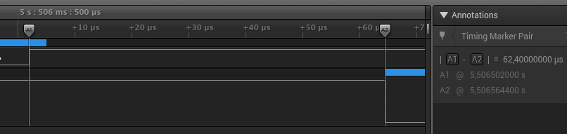

# Performing a timing attack
There are two password gueses in our capture file. First, create a new Analyser for Channel 0, same way you did it for Channel 1. Now you can see that the two password guesses are `xxxxx` and `pxxxx`. The first character of the second guess is correct so it should take longer to validate that guess.

To find out if that's the case we need to measure the time it takes between the end of transmission of the last character on Channel 0 (the one where we send the password guess to the board) and the beginning of the `Incorrect password!` response on Channel 1. For that we need to zoom in (by scrolling) on the second "dip" (data transmission) on Channel 1. Now go to the "Annotations" box on the right and click on `A1`. Snap the timing marker to the end of the transmission on Channel 0 (where the channel goes high). Click on `A2` and snap it to the beginning of the trasmission on Channel 1 (where the channel goes low).

Your screen should look similar to the screenshot below.


You can see that it took 62.4 microseconds to validate the password in this instance. Now do the same to the second password guess (the third "dip" on Channel 1). Zoom out first and then zoom in on the last "dip". Click on the `+` next to the "Annotations" box and add a new timing marker pair. Put the markers in the similar positions like before. Now your measurement should read "61.6 microseconds". Wait, but that's... shorter?

Here's a thing about timing attacks and CPUs. CPUs have lots of stuff to do, they are very busy, even if they are idle. What happens is that the difference between one correct password character and no correct password characters is so small that sometimes it just isn't there. That's the case here and that's what we learned the hard way. So... is there a way to make the attack more reliable?

Well, if there's a random delay at play the best thing would be to just gather many, many samples and average the out. That's what we will be doing. I wrote a simple Python script which tests different password.

```
from __future__ import print_function
import sys, serial

password = [0,0,0,0,0]
port = sys.argv[1]

with serial.Serial(port, 115200, timeout=10) as ser:
        for c in xrange(256):
            password[offset] = c 
            print("Trying {}...".format(c))
            for i in xrange(1000):
                ser.read_until(b":")
                ser.write(password)
```

The script goes over all the byte values from 0 to 255 and tries a password which begins with that byte and has the rest of the bytes set to `0`. Each byte is tried 1,000 times. We can now record all these tries using our Logic analyser and calculate the average time it takes to validate the password with each character.
