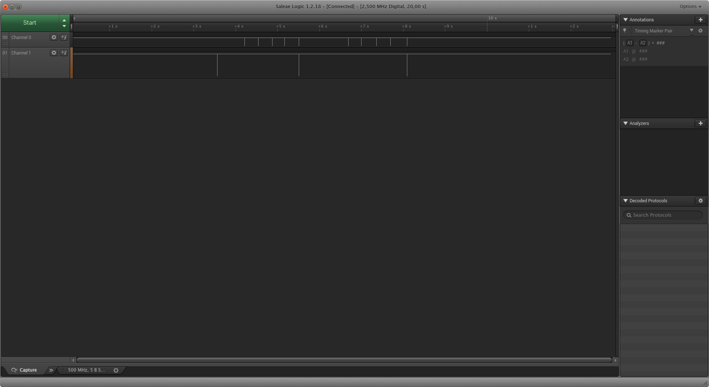

# Getting the data dump
We will be using Saleae Logic Analyser in red (because red is faster than black, obviously). Since we want to inercept RX and TX we will connect channel 0 to RX and channel 1 to TX, as shwon below. We should also make sure to connect Arduino Uno ground to the logic analyser ground.

As you know form the code the protocol we are using is a serial (or UART) protocol. This means that the data is sent and received using two different wires (or channels). One - TX - is used to transmit the data from the board to our computer and the other one - RX - is used to end the data from the computer to the board where our password checking code runs. Let's record some communication. First we need to connect Arduino to our computer and send a password guess. This whole communication has to be recorded on our Logic Analyser.

After the recording is done let's open it in the Logic software. [Download this dump of the communication](assets/password_try.logicdata) and open the Logic software. Then clikc on "Options" (upper right corner) and choose "Open capture / setup" and choose the downloaded file. Your screen should look similar to the screen below.

The main window contains two channels: channel 0 and channel 1. Channel 0 is connected to RX (the pin which receives the data from the computer) and channel 1 is connected to TX (the pin which transmits the data to the computer). You can also see that both channels are mostly high with some "dips." These "dips" are where the data transmission is taking place. Zoom in (by scrolling) on the first dip in channel 1. You should see a series of highs and lows like shown below.

Sinc ethis is channel 1 it means that the transmission is coming from the board to the computer. If you remember our serial communication session you might've already guessed what this is. This is most likely the `Password:` prompt we get from the board asking us to enter the correct password. But how is this encoded? What do the squiggly lines actually mean? Well, for that you need to go to the next part!

[Decoding the serial protocol >>>>](protocol)
