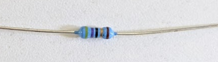
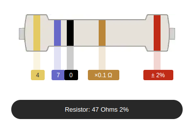
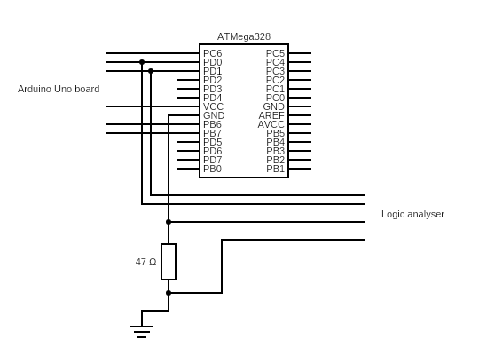

# Fixing the password check(?)
The easiest fix is to not optimise the for loop and just check every character of the password like so:

```
bool checkPass(String buffer) {
  bool result = true;
  for (int i = 0; i < PASSWORD.length(); i++) {
    if (buffer[i] != PASSWORD[i]) {
      result = false;
    }
  }
  return result;
}
```

Well, there's still a bit of problem. Now depending on how many password characters are false the check will take longer (the `result` variable has to be updated). So if we have one character correct and rest of them incorrect the password validation will be faster than if all of the characters are incorrect.

However, can we really measure that very small difference? Trying to repeat the same procedure, but this time looking for the fastest password validation, gives us very inconclusive results:

```
63370.0 16 
63358.5 229 �
63346.0 47 /
63314.0 17 
63268.5 0
```

Not only `p` isn't on the list, but the differences between the different byte values are small and there's no one, clear outlier. So it means that the problem is solved and our password checking routine is secure!

Well, not really.

Saleae logic analyser also has analog channels, which makes it a bit like an oscilloscope (don't yell at me, it's a course that deals with basics, I can make this simplification!). It means that some channels can be used not only to measure whether the voltage is "high" or "low" (aka binary) but also the actual value of the voltage. Why is this important?

Different CPU instructions have different power usage. Intuitively (again, this is simplification) changing two bits of a variable will produce a different power drain than changing just one bit. Similarly setting the boolean value to false will produce a different power usage than not setting it (this should be pretty obvious). So maybe we can just record the power usage and see if it's any different when we try `xxxxx` and `pxxxx`? Let's do that!

First we have to make sure that the power measurement is as accurate as possible. In order to do that we need to take the ATMega328 CPU chip out of the board socket, put it on a breadboard and measure the power usage of the CPU itself and not of the whole board. The reason for that is that the board contains capacitors (as shown at the beginning of this course) and those capacitors are meant to stabilise the current. This can influence our readings.

So the first thing to do is to take out the CPU and put it on the breadboard and reconnect all the CPU pins back to the board. This will allow us to interface with the CPU conveniently using the same USB socket we've used before. The picture below shows what the CPU connected back to the board looks like.


What you can see above is that I didn't connect all the pins back to the socket, only some of them. That is because we don't need all the pins - some of them are responsible for digital or analog inputs from external sources, which we do not use.

The ones we need are:

* Reset (so that we can use the reset button and reboot the CPU) - first one on the upper left
* RX and TX to communicate with the CPU - next two on the upper left (as you may remember from the previous pictures)
* Power and ground (chip has to be powered somehow) - next two
* Clock (so that the CPU knows when to execute instructions) - next two


... and that's all. In total that's 7 pins connected back to the board. You can find out which ones are which by looking at the [ATMega328p datasheet](assets/atmega-datasheet.pdf) - take a look at the upper right corner of page 2.

Now that it's all connected back we run into another small problem. The logic analyser, much like the oscilloscope, can only measure voltage, not current. However, the CPU power usage will alter current and not voltage - voltage stays more or less the same.

It's a bit like the pressure in your water tap (voltage) and the actual water flow from your tap (current). When you wash your hands (and please do it often!) you're turning the tap on and the water (current) starts to flow, because you want to use the water. Pressure stays more or less the same.

So we have to measure the power current, but we can only measure the voltage. How can we do that? Well, there are rather expensive current probes which you can buy and they use [the Hall Effect phenomenon](https://en.wikipedia.org/wiki/Hall_effect) to measure the current by clamping over the wire. However, there's also a cheaper solution - using a small resistor.

According to [Ohm's law](https://en.wikipedia.org/wiki/Ohm%27s_law) the current is simply a voltage divided by resistance or, if you rearrange the variables, voltage is current times resistance.


If the resistance is fixed (e.g. over a resistor with a fixed value) then any changes in current will result in changes in voltage multiplied by that resistance. So, if we have an 1 Ohm resistor every change in current (in amps) will result in the same numerical change in voltage (in volts).

If we have a resistor with a higher resistance then every small change in the current will result in an amplified change in voltage. However, if the resistance is too high the CPU won't be able to draw the power needed to perform the operations. The CPU runs at a specific voltage (in this case 5V) and if any change in current results in a change in voltage then at some point there won't be enough voltage to make that change and the CPU will power down.

It seems like we have to choose the resistor carefully. Fortunately ATMega328 is a rather indestructible CPU and we can choose a rather high value. In fact we will be using the resistor below. Can you figure out what the resistance value is just by looking at the resistor? Try looking for the "resistor colour code" on Google.



The way to read the resistance value is to look at the colourful bands and compare them with the chart below. Our resistor has 5 bands: yellow, violet, black, gold and red. [Digikey provides a very convenient resistor colour code calculator](https://www.digikey.com/en/resources/conversion-calculators/conversion-calculator-resistor-color-code-5-band) where you can enter the colour values and you will get the resistance value. In our case it's 47 Ohms.



So every change in current will be multiplied by 47 and result in that change in the voltage. Now that everything is ready, the only thing left to do is to connect our resistor on the CPU ground wire, connect logic analyser to RX, TX and to the resistor (in order to measure voltage) and gather the data!



[Let's gather some power traces! >>>>](traces.md)
