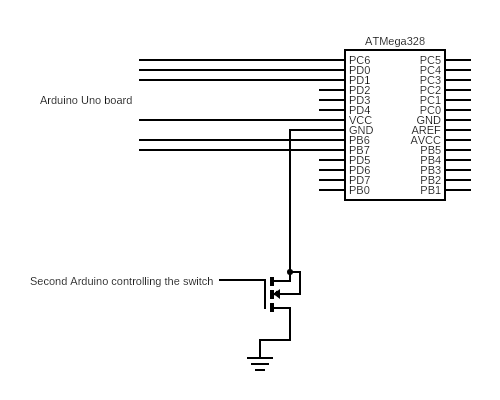

# Limiting the password attempts
Limiting our password checking routine to only three password guesses is a bit more challenging, because the number of guesses has to persist across CPU reboots. `EEPROM.write` and `EEPROM.read` are just ways that Arduino manages persistent memory. First argument for both method is a memory address - the place where we will be storing our counter.

```
bool checkPass(String buffer) {
  byte tries = EEPROM.read(TRIES_ADDR);
  if (tries == 0) {
    return false;
  }
  bool result = true;
  for (int i = 0; i < PASSWORD.length(); i++) {
    if (buffer[i] != PASSWORD[i]) {
      result = false;
    }
  }
  if (result) {
    EEPROM.write(TRIES_ADDR, 3);
  } else {
    EEPROM.write(TRIES_ADDR, tries - 1);
  }
  return result;
}
```

The method first checks if there are any tries left. If there aren't it returns `false`. If there are some tries left it will perform regular password validation and then decrement the counter. Now we can rest easy that our password check routine is secure.

Well, not really. The thing is that in the main code we have this:

```
  bool correct = checkPass(pass);
  if (correct) {
    Serial.println("Password correct!");
```

This means that there is a signle point of failure - if the execution of checkPass fails (for whatever reason) and erroneously produces `true` the board will be unlocked with a `Password correct` message.

> This is a point in the training where most of the participants have either a very confused look or think I'm joking. It's fine if you had the same reaction, as the rest of this course deals with what can be described as magic.

If we can somehow inject a fault and make the `checkPass` method believe that the password is correct we can unlock the board. We do not even have to know the password in order to do that. ATMega328 CPU, like all electronics, has a minimum operating voltage. It's unclear what happens if the voltage drops for a very, very small amount of time.

In our imperfect mental image we can imagine that the CPU would like to draw some power to flip a bit, but we turn off the power supply for that very short moment and it's not able to do that. However, we turned the power for such a small amount of time that it didn't power down the CPU. It has entered an erroneous state. This is what we will try to attempt.

In order to drop a voltage for a very small amount of time we will use a transistor, which is electronically operated switch. We will use a second Arduino board to control that transistor and very quickly turn the votage off and on in hopes that are target Arduino won't notice that.

The circut looks like this:



The transistor is responsible for switching the power on and off. Most of the time the power will be on (otherwise the CPU won't work) and the second Arduino board will turn it off for a very short time - few CPU cycles. Since we don't know or care how long a glitch (powering down the CPU) should be we are going to try different values in this very simple Arduino code:

```
void loop() {
  int waste = 0;
  for (int i = 0; i < offset ; i++) { waste++; }
  digitalWrite(glitchPin, LOW);
  for (int i = 0; i < glitchLength ; i++) { waste++; }
  digitalWrite(glitchPin, HIGH);
  delay(500);
  glitchLength += 10;
  if (glitchLength > 10000) {
    glitchLength = 1;
    offset *= 2;
  }
}
```
