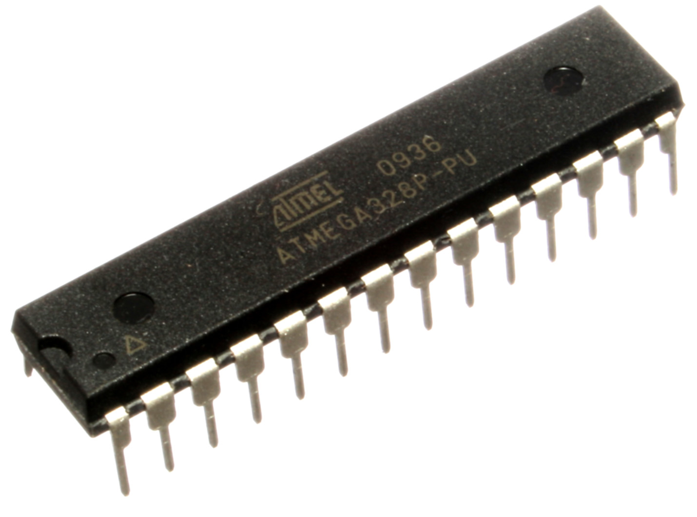

# Timing is key

There's a difference in time it takes to validate the password based on the number of characters that are correct. Take a look at step-by-step `checkPass` verification of two password tries below -- one with all characters incorrect and one with one correct character.

`xxxxx` | `pxxxx`
------------ | -------------
`i = 0` | `i = 0`
`i < 5` | `i < 5`
`read PASSWORD[0]` | `read PASSWORD[0]`
`read buffer[0]` | `read buffer[0]`
`compare two values` | `compare two values`
`return false` | `i = 1`
\- | `i < 5`
\- | `read PASSWORD[1]`
\- | `read buffer[1]`
\- | `compare two values`
\- | `return false`

As you can see in the first case the `checkPass` `for` loop does only one iteration (since the first character is incorrect) and in the second case it does two (since the first character is correct, but the second one is incorrect). This is the whole purpose of returning from the method sooner - to make it run shorter and use less resources.

So can we detect this timing difference if we have access to the hardware? Let's first set up our experiment.

We will be using an Arduino Uno board, which uses an ATMega328 CPU, like the one pictured below.



The board also has some additional elements responsible for making sure that the power flow is stable (capacitors), that we can communicate with a computer (the USB socket) that we can power the board using external power source and so on. Picture below shows the main components of the board.


The CPU can be programmed with our password checking routine using Arduino IDE. Once we paste the code we can compile it and upload it to the board. Then we just connect using a serial console to the board and we can see the password prompt, like the one below.

```
$ picocom ....
```

We now have access to the board, but how to measure the time it takes to validate the password? We can create a script which takes time mesurements before we send out a password guess and the time we receive the response, but there's so much latency in that communication that the results will be useless.

Instead, we can use a logic analyser. Logic analyser is a piece of hardware which can intercept and record the digital communication from the board. ATMega328 CPU uses serial communication (as does USB) which means that there are two wires - one to send the data (TX) and one to receive the data (RX). These are exposed on the first two pins of the ATMega328 CPU.


These pins are exposed on the board in the upper left corner (see the pictures above). They are even convieniently signed with "RX" and "TX". This is the same data that is sent through USB to a serial terminal running on the computer. Let's connect logic analyser to these two pins and record the whole communication.


[On to the Logic software to process our data dump! >>>>](dump)
