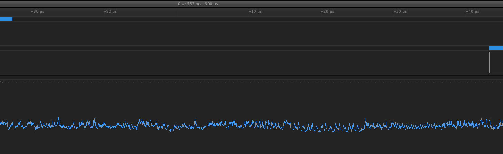
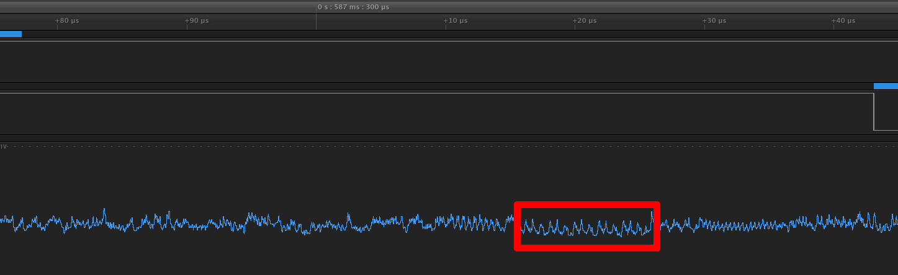
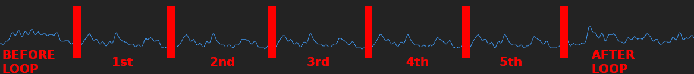
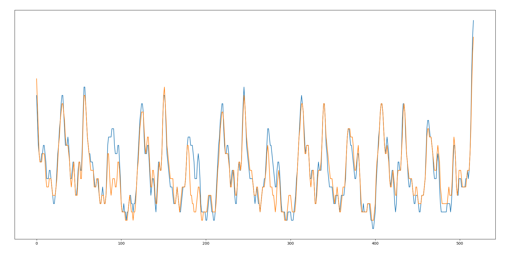
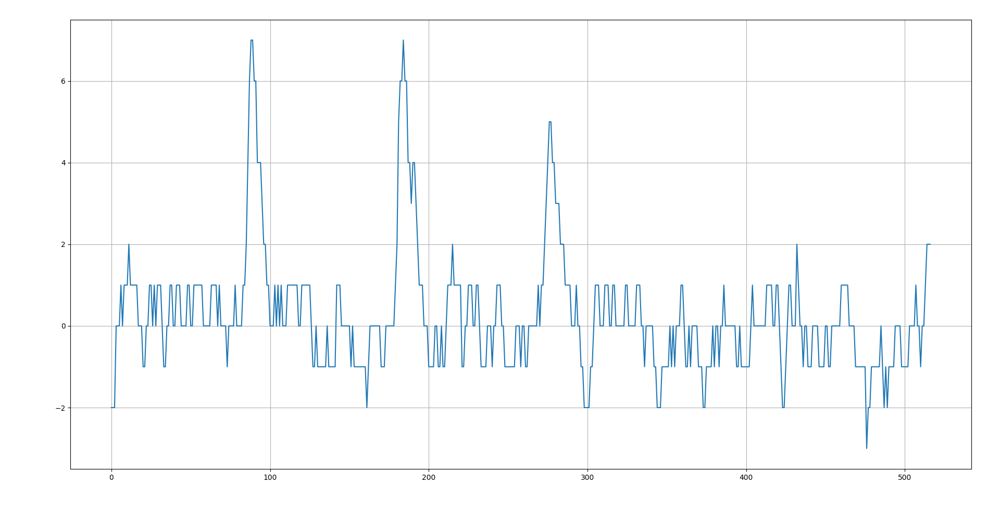

# Looking at the power traces
[Download this Logic capture](assets/power_analysis.logicdata.7z) and open it in the Logic software. You should see one second capture with 5 password tries. The password have more and more correct characters up to the actual password. Under the TX and RX channels you can see the analg channel that captures voltage accross the resistor, which corresponds to the power draw of the CPU. If you zoom in on the period between the first password guess and the first response you should see something similar to the screenshot below (notice how the blue boxes on the top are positioned).

Now the question becomes: where is `checkPass`? We're looking for five loop iterations, all of which will have the same instructions (since all the characters are wrong) and the same power trace. There's a couple of plausible places, but there's a place between two "squigly" patterns which seems to have the same power trace five times. Take a look at the screenshots below.

Hopefully you can see all the 5 loop iterations (i.e. 5 same power traces). Now that you guessed where the for loop is (with a little bit of help) the question is: is there any difference between power traces where one of the characters is correct and the one above? For this we have to compare two screenshots of power traces from two different password guesses. You can do that in the Logic software, but I exported the data and created two overlapping charts so that the comparison is slightly easier.

The blue line shows the power trace without any correct password characters and the orange one shows a power trace for three correct characters. It may be hide to see the difference, so let's plot the difference between the power traces.

Now I hope you can clearly see that there are some small differences here and there, but there three pretty big peaks. If you look closely at the previous chart you can see that the orange line dips in the same three places. Take a look at different password guesses in the Logic capture and see if you can figure out how many of the first characters are right.

This power analysis method is much more powerful than the timing attack. Not only does it work where the timing attack doesn't, but also based on one guess you can figure out how many(!) characters you got right and you can also guess characters in the middle of the password!

Seems like the only option is to limit the number of password guesses to, let's say, 3. Now the password check is secure, right? Let's see!

[Only three password guesses are allowed! >>>>](three.md)
